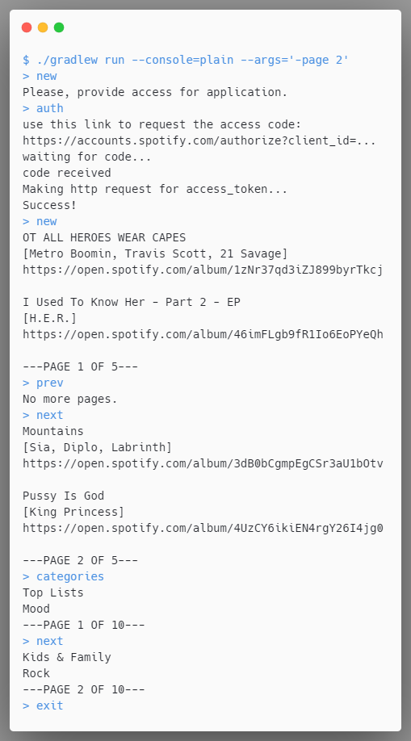

# Music Advisor

## Some info 

This is a personal music advisor that makes preference-based suggestions and even shares links to new releases and featured playlists. Together with Spotify, your music advisor will be a powerful guide to the world of music.\
It is one of the [hyperskill's] projects that was made to learn how to work with spotify's API.

## How to launch

```shell script
./gradlew run --console=plain --args='-page 2'
```
Hope it works 😅

**Available arguments**

- **-access *nameOfAccessServer*** - path of the access server, https://accounts.spotify.com by default
- **-resource *nameOfResourceServer*** - path of the resource server, https://api.spotify.com by default
- **-page *numberOfItems*** - number of items rendered on a page, 5 by default
- **-clientId *clientId*** - the id of the spotify's client, 60340c6859bf48dfbecd3b2d8f80b69a by default
- **-clientSecret *clientSecret*** - the client's secret code, 3fc7a79f20d740e0b08489f6f89d6b04 by default

## Workflow example



[hyperskill.org]: https://hyperskill.org/
